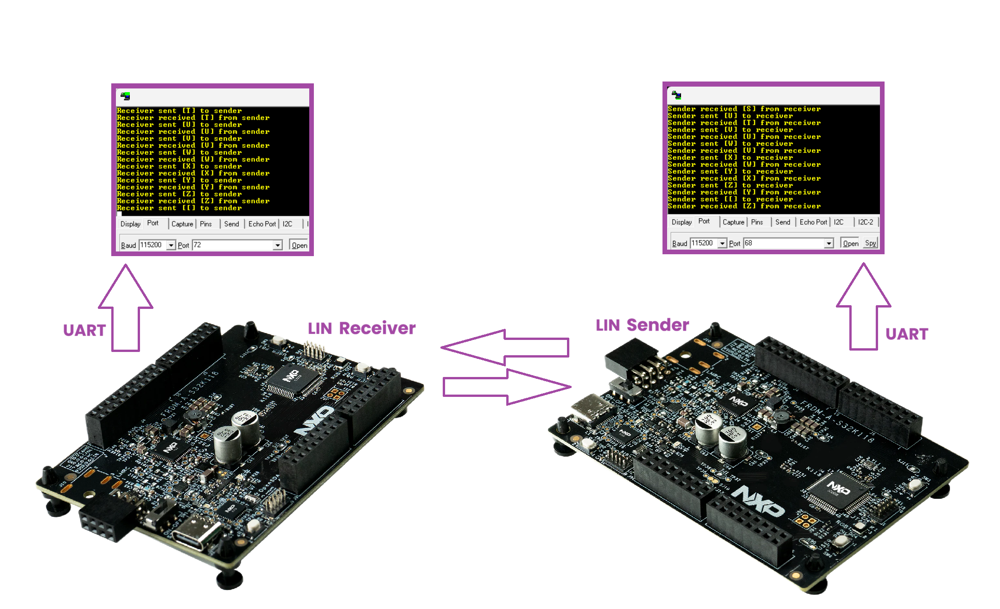
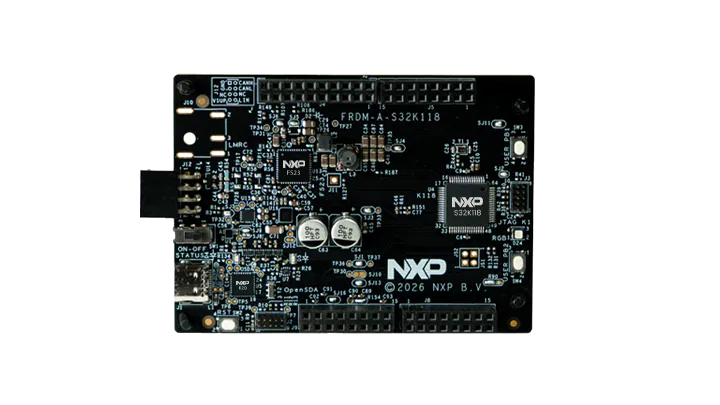
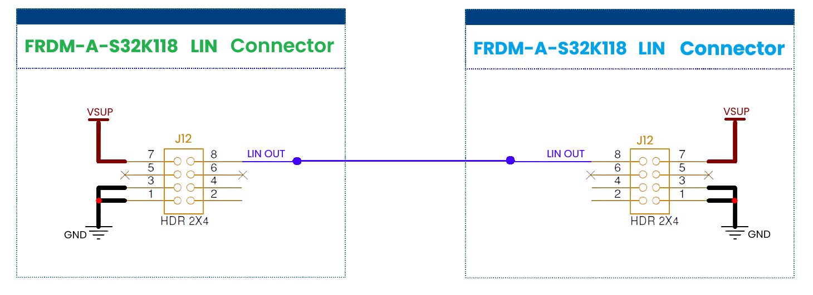
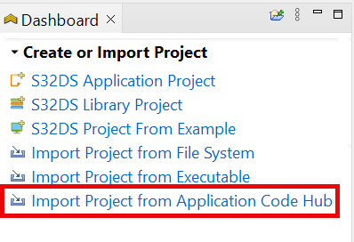
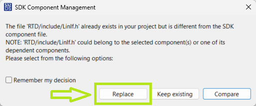
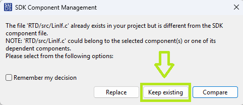

# NXP Application Code Hub
[](https://www.nxp.com)

## LIN Signal-Based Communication Example
This example demonstrates signal-based LIN 2.1 communication between two NXP FRDM-S32K118 boards using the AUTOSAR LIN stack and NXP RTD drivers. One board is configured as the LIN Master and periodically transmits an ASCII character through a LIN signal contained in a standard communication frame, while the second board acts as the LIN Slave and publishes the subsequent ASCII character in a separate LIN frame. The exchanged values are displayed on the UART console, providing a simple demonstration of LIN signal transmission, frame scheduling, and Master-Slave communication.
[<p align="center"></p>](./images/FRDM-A-S32K118_LIN.png)

#### Boards: FRDM-A-S32K118
#### Categories: Networking
#### Peripherals: UART, LIN
#### Toolchains: S32 Design Studio IDE

## Table of Contents
1. [Software and Tools](#step1)
2. [Hardware](#step2)
3. [Setup](#step3)
4. [Results](#step4)
5. [Support](#step5)
6. [Release Notes](#step6)

## 1. Software and Tools<a name="step1"></a>
This example was developed using the S32K1 Real-Time Drivers (RTD) package for S32 Design Studio.
To download and install the complete software and tools ecosystem use the link below:
- [S32K1 RTD Software Package](https://www.nxp.com/app-autopackagemgr/automotive-software-package-manager:AUTO-SW-PACKAGE-MANAGER?currentTab=0&selectedDevices=S32K1)
- Serial terminal program (for example: PuTTy, Tera Term, RealTerm etc.)

## 2. Hardware<a name="step2"></a>
### 2.1 Required Hardware
- Personal Computer
- 2x [FRDM-A-S32K118](https://www.nxp.com/design/design-center/development-boards-and-designs/FRDM-A-S32K118)<p><p>
- 2x Type-C USB cable

### 2.2 Hardware Connections
- Connect the LIN communication pin (J12-8) between the 2 FRDM-A-S32K118's boards
[<p></p>](./images/FRDM-A-S32K118_LIN_Connections.png)

### 2.3 Debugger Connection
- Connect the Type-C USB cable to PC and on both FRDM-A-S32K118 boards for power supply and debugging.

## 3. Setup<a name="step3"></a>

### 3.1 Import the Project into S32 Design Studio IDE
1. Open S32 Design Studio IDE, in the Dashboard Panel, choose **Import project from Application Code Hub**.
   [<p align="center"></p>](./images/import_project_1.png)

2. You can find the demo you need by searching for the name directly
3. Open the project, click the **GitHub link**, S32 Design Studio IDE will automatically retrieve project attributes, then click **Next>**.
    [<p align="center"></p>](./images/import_project_3.png)

4. Select **main** branch and then click **Next>**.

5. Select your local path for the repo in **Destination->Directory:** window. The S32 Design Studio IDE will clone the repo into this path, click **Next>**.

6. Select **Import existing Eclipse projects** then click **Next>**.

7. Select the 2 projects in the repository then click **Finish**.

### 3.2 Generating, Building and Running the Example

1. In Project Explorer, right-click on each project and select **Update Code and Build Project**. This will generate the configuration (Pins, Clocks, Peripherals), update the source code and build the project using the active configuration (e.g. Debug_FLASH).
Make sure the build completes successfully and the *.elf file is generated without errors.
[<p align="center"></p>](./images/update_and_build.png)
2. If during this process a pop-up appears asking whether or not to replace or keep the existing LIN configuration files, it's very important to select **Replace**, otherwise build issues may occur.
[<p align="center"></p>](./images/build_project_1.png)
> **Note:** With the HSE firmware package installed (e.g. `HSE_FW_S32K344_0_2_55_0_D2502`), **Replace** can cause build errors. In that case select **Keep existing** and rebuild.
[<p align="center"></p>](./images/build_project_2.png)
#### Debugging the projects
Go to **Debug** and select **Debug Configurations**. Select **GDB PEMicro Interface Debugging**:
[<p align="center"></p>](./images/DebugConfigurations.png)

Use the controls to control the program flow.

> Note: The GDB PEMicro Interface Debugging configuration uses a default ports 6224 and 7224. In example are provided 2 debug configurations, one with default ports and another one with custom ports to support debugging of 2 boards simultaneously on the same PC. In one launch configuration, select one board (for example USB1) and in the second launch configuration, select the other board (for example USB2).

## 4. Results<a name="step4"></a>
Open a serial terminal on the enumerated COM port (typical settings: 115200 baud, 8 data bits, no parity, 1 stop bit, no flow control).  
The LIN Sender begins cycling through the printable ASCII range and the LIN Receiver echoes back the next character. Each node prints the character it sent or received together with the transport-layer transfer status.

On the __Sender FRDM-A-S32K118__ terminal you should see:

```javascript
Sender sent [A] to receiver
Sender received [B] from receiver
Sender sent [B] to receiver
Sender received [C] from receiver
Sender sent [C] to receiver
Sender received [D] from receiver
...
```

On the __Receiving FRDM-A-S32K118__ terminal you should see:

```javascript
Receiver received [A] from sender
Receiver sent [B] to sender
Receiver received [B] from sender
Receiver sent [C] to sender
Receiver received [C] from sender
Receiver sent [D] to sender
...
```

The first FRDM-A-S32K118 transmits one character per LIN schedule cycle over the transport layer (MasterReq frame `0x3C`, SID `0x23`). The 2nd FRDM-A-S32K118 receives it, increments the value by one, and returns it in the response frame (SlaveResp `0x3D`, RSID `0x63`). The transmitted character advances through the printable ASCII range (`0x20`..`0x7F`) and wraps back to `0x20` (space) after `0x7F`, so the two terminals stay one character apart and loop continuously.

## 5. Support<a name="step5"></a>
For general technical questions related to NXP microcontrollers, please use the [NXP Community Forum](https://community.nxp.com/).
#### Project Metadata

<!----- Boards ----->
[](https://mcuxpresso.nxp.com/appcodehub?hwBoard=FRDM-A-S32K118)

<!----- Categories ----->
[](https://mcuxpresso.nxp.com/appcodehub?category=networking)

<!----- Peripherals ----->
[](https://mcuxpresso.nxp.com/appcodehub?peripheral=uart)
[](https://mcuxpresso.nxp.com/appcodehub?peripheral=lin)

<!----- Toolchains ----->
[](https://mcuxpresso.nxp.com/appcodehub?toolchain=s32_design_studio_ide)

Questions regarding the content/correctness of this example can be entered as Issues within this GitHub repository.

>**Note**: For more general technical questions regarding NXP Microcontrollers and the difference in expected functionality, enter your questions on the [NXP Community Forum](https://community.nxp.com/)

[](https://www.youtube.com/NXP_Semiconductors)
[](https://www.linkedin.com/company/nxp-semiconductors)
[](https://www.facebook.com/nxpsemi/)
[](https://x.com/NXP)

## 6. Release Notes<a name="step6"></a>
| Version | Description / Update                           | Date                           |
|:-------:|------------------------------------------------|-------------------------------:|
| 1.0     | Initial release on Application Code Hub        | October 1<sup>st</sup> 2026 |
